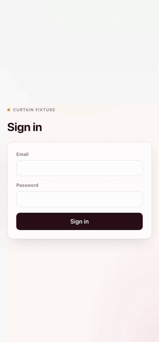

<div align="center">


# Curtain

### Let your agents show you what they built.

Your agent says the feature works. Curtain is how it proves it: bring your stack up,
drive the real app in a real browser, record what happened, tear it down.

<sub>**Playwright writes the script. Curtain stages it.**</sub>

[](https://github.com/jdsalomon/curtain/actions/workflows/ci.yml)
[](LICENSE)
[](package.json)
[](package.json)

</div>

---

> **v0.3.0 starts fresh checkouts.** v0.1.0 built the somewhere, v0.2.0 films it, and
> this release fixes the reason a new clone or worktree could not boot at all: env
> files are gitignored, so they travel with nothing. Seeded data is next. The
> [roadmap](ROADMAP.md) marks every unreleased version as planned, on purpose.

## Try it in under a minute

No install, no dependencies, no database. The fixture is two real apps in a single
file you can read in a minute:

```console
$ cd fixture
$ curtain up
started  admin      http://localhost:52902  pid 10884
started  guest      http://localhost:52903  pid 10885

$ curtain up
reused   admin      http://localhost:52902  pid 10884
reused   guest      http://localhost:52903  pid 10885
```

Nothing restarted the second time, which is the point: a cold framework compile costs
more than everything else this tool does put together.

Now make it prove itself. The walk signs in, adds an item, and waits for the card to
go green, all against whichever port the resolver just found:

```console
$ curtain walk add-an-item
walk     add-an-item
target   admin at http://localhost:52902
video    /Users/you/code/curtain/.curtain/walks/add-an-item/add-an-item.mp4
gif      /Users/you/code/curtain/.curtain/walks/add-an-item/add-an-item.gif

passed
```

<div align="center">

</div>

That gif is not a mockup. It is the file that command wrote, and Curtain recorded it
by driving the app in this repository.

Now break it on purpose, and watch what does **not** appear:

```console
$ curtain walk _broken
walk     _broken
target   admin at http://localhost:52902
webm     .curtain/walks/_broken/video/page@2d23da55.webm

WALK_FAILED
  locator.boundingBox: Timeout 30000ms exceeded.
  the recording up to the failure is at .curtain/walks/_broken/video/page@2d23da55.webm

FAILED
```

Exit 1, and no mp4. A shareable video exists only for a run that passed, so a clean
recording is a passing test rather than a promise. The raw webm is kept, because the
frames leading up to a failure are usually the fastest way to understand it.

Now start a rival copy from its own git root and watch Curtain refuse to adopt it:

```console
$ node rogue.mjs &
rogue root: /tmp/curtain-rogue-EQPK1W

$ curtain resolve
other checkouts
  52904      curtain-rogue-EQPK1W  pid 10901

$ curtain down
stopped  admin      was http://localhost:52902
stopped  guest      was http://localhost:52903
```

Two stopped, and the rogue is still serving. It was never yours to stop.

## What you get

```console
$ curtain resolve

workspace  /Users/you/code/app/.worktrees/feature-x
           worktree on feature/x, id 7c382ad4

running
  admin      http://localhost:4310  pid 41022  via runfile
  guest      http://localhost:4311  pid 41023  via runfile

other checkouts
  3001       app                 pid 4109
  3003       app-hotfix          pid 34039
  3010       worktrees/redesign  pid 97912
```

Two of those are yours and three are not, across four checkouts of one repo. An agent
that cannot tell them apart will demo you someone else's branch and be convincing
about it.

Curtain identifies a server by **who started it**, never by guessing from paths, and a
server it cannot account for is reported rather than adopted. The
[design notes](docs/DESIGN.md#the-resolver-contract) explain why paths cannot answer
this and what happens under monorepo task runners.

## Use it on your own project

| Skill | What it does |
|---|---|
| `/setup` | detects how your project starts, asks only what it cannot detect |
| `/up` | starts what is missing, reuses what is healthy, links missing env files |
| `/env` | gets a checkout its env files without ever reading a value |
| `/walk` | drives the app in a real browser and records it |
| `/down` | stops exactly what this workspace started |

Under the skills is a CLI you can run yourself:

```bash
curtain doctor            # can this phase run, and what debt has piled up
curtain resolve --json    # the raw truth, for when you want to see it
curtain up   [app...]
curtain down [app...]
curtain walk [name]       # no name lists them
curtain env  [link|adopt] # bare = status; values never appear in any output
curtain setup detect | apply
```

Every command takes `--json`. Failures are values with stable codes and a `fix` line,
never a stack trace, so an agent branches on the code and never on wording.

A walk lives in `curtain/walks/<name>.mjs` and is a module Curtain calls, not a script
you run. So it imports no Playwright, resolves no paths into the plugin, and above all
names **no port**:

```js
export const meta = { target: 'admin', viewport: 'phone' }

export default async function ({ page, url, click, type, sleep }) {
  await page.goto(url('/login'))
  await type(page.getByLabel('Email'), 'ada@example.com')
  await click(page.getByRole('button', { name: 'Sign in' }))
  await page.locator('.saved').waitFor()   // the assertion is the demo
  await sleep(1200)                        // let the payoff land on camera
}

export async function cleanup({ request, url }) {   // runs even if the walk throws
  await request.delete(url('/items'))
}
```

`target: 'admin'` is the entire address. Whatever port that app landed on this morning,
in this worktree, is the resolver's problem and never the walk's.

## Install

Curtain is a **zero-dependency Node CLI plus an MCP server**, so it is not tied to one
agent harness. Claude Code gets a plugin manifest today; anything that can run a command
and speak MCP can drive it.

<details open>
<summary><b>Claude Code</b></summary>

```
/plugin marketplace add jdsalomon/curtain
/plugin install curtain@curtain
```

Skills and the Playwright MCP server come with it, and `bin/` lands on the Bash tool's
`PATH`, so a bare `curtain` just works.

</details>

<details>
<summary><b>Any other agent harness</b></summary>

```bash
git clone https://github.com/jdsalomon/curtain
cd curtain && npm link          # or just put ./bin on your PATH
curtain --version
```

Then register the browser MCP server the way [`.mcp.json`](.mcp.json) does. The CLI is
the whole engine: nothing under `lib/` has harness-specific code. The prose half lives
in [`skills/`](skills/) as markdown with YAML frontmatter, so point your harness at
those files or read them yourself.

First-class packaging for other harnesses is on the [roadmap](ROADMAP.md).

</details>

## Configuration

One committed file, `curtain.json`, holding only facts that cannot go stale:

```json
{
  "name": "myproject",
  "apps": {
    "admin": {
      "start": "make admin-dev",
      "ready": "Ready in",
      "env": ["apps/admin/.env.local"],
      "fingerprint": { "path": "/login", "expect": "password" }
    },
    "guest": { "start": "make guest-dev", "ready": "Ready in" }
  }
}
```

`env` names the gitignored files an app needs, which is exactly what a fresh clone or
worktree is missing. The values live once per project on your machine, in a store keyed
by `name`; every checkout reaches them through a symlink that `curtain up` creates
itself. The schema stays in your committed `.env.example`, so a branch that adds a
variable is caught by name, and the values never appear in any output.

**Ports and pids are never stored.** They are discovered every time, because a stored
port is a lie waiting to happen. `curtain.local.json` is gitignored and merged over the
top for the teammate who starts the app differently. `.curtain/` is machine-local state
and belongs in `.gitignore`, which `setup` handles: the dot is the mnemonic, **dotted is
disposable.**

## Where this is going

**Your agent should never have to say "it works, trust me."**

Bring the stack up. Give it data of its own. Drive the real app. Record what happened.
Tear it down. One command each, in a repo Curtain has never seen.

Isolated data per workspace, one declaration rendered as either a demo or a test
suite, and a cache that makes each new recording cheaper are the releases after this
one. See [ROADMAP.md](ROADMAP.md).

## The rest

- **Platforms:** macOS and Linux, both covered by CI, because reading a process's
  working directory is `/proc` on one and `lsof` on the other. Windows reports
  `UNSUPPORTED_PLATFORM` rather than pretending.
- **Design:** [docs/DESIGN.md](docs/DESIGN.md), including the decisions that were wrong
  first.
- **Brand:** [docs/BRAND.md](docs/BRAND.md) and [`assets/`](assets/).
- **Contributing:** [CONTRIBUTING.md](CONTRIBUTING.md).

## License

MIT
